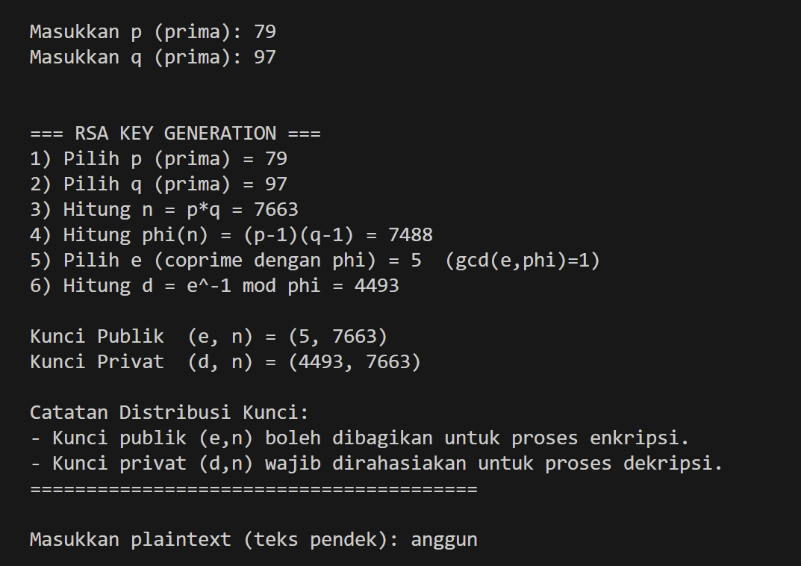
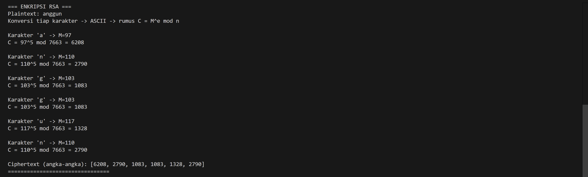
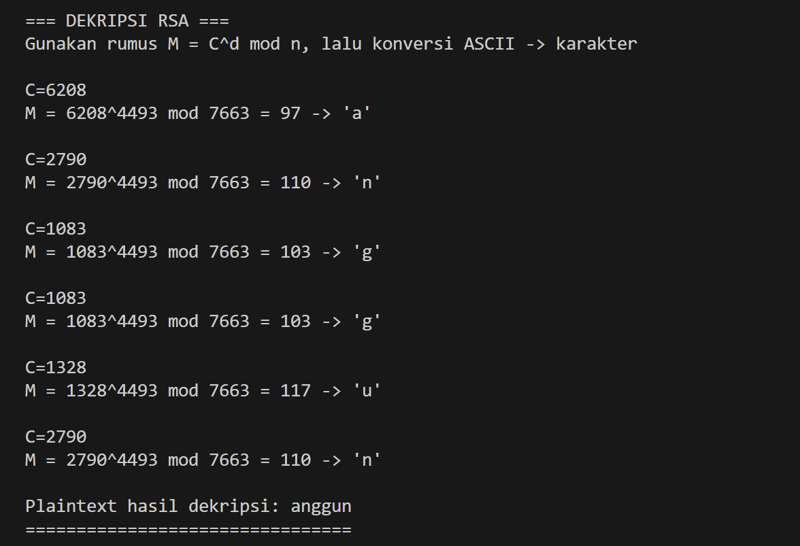
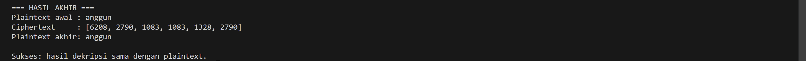

# Implementasi Algoritma RSA (Kriptografi Asimetris)
Anggun Ismi Nurhalisa - 24051204039 - TI B 24

## Deskripsi
Repository ini berisi implementasi sederhana algoritma kriptografi RSA (Rivest–Shamir–Adleman) menggunakan bahasa Python. 

Implementasi ini bertujuan untuk menunjukkan bagaimana proses pembangkitan kunci (key generation), enkripsi, dan dekripsi dilakukan secara matematis pada algoritma RSA.

---

# Konsep RSA
RSA merupakan algoritma kriptografi kunci publik (public-key cryptography) atau kriptografi asimetris. Algoritma ini menggunakan dua kunci yang berbeda, yaitu:

- **Kunci Publik (Public Key)** → digunakan untuk proses enkripsi pesan  
- **Kunci Privat (Private Key)** → digunakan untuk proses dekripsi pesan  

Keamanan algoritma RSA bergantung pada kesulitan dalam memfaktorkan bilangan besar yang merupakan hasil perkalian dua bilangan prima.

---

# Tahapan Algoritma RSA

## 1. Pembangkitan Kunci (Key Generation)

Langkah-langkah pembangkitan kunci pada RSA adalah sebagai berikut:

1. Memilih dua bilangan prima besar
   p dan q
2. Menghitung nilai modulus
   n = p × q
3. Menghitung fungsi totien Euler
   φ(n) = (p − 1)(q − 1)
4. Memilih bilangan eksponen publik `e` yang memenuhi syarat  
   1 < e < φ(n)  
   gcd(e, φ(n)) = 1
6. Menghitung eksponen privat `d`
   d × e ≡ 1 (mod φ(n))

Setelah proses tersebut diperoleh pasangan kunci:    
Public Key = (e, n)  

Private Key = (d, n)  

---

## 2. Proses Enkripsi

Plaintext (pesan asli) terlebih dahulu diubah menjadi bentuk numerik menggunakan kode ASCII.

Proses enkripsi dilakukan menggunakan rumus:
C = M^e mod n

Keterangan:

- M = plaintext dalam bentuk angka  
- e = eksponen publik  
- n = modulus  
- C = ciphertext (hasil enkripsi)

Hasil dari proses ini adalah ciphertext yang tidak dapat dibaca tanpa kunci privat.

---

## 3. Proses Dekripsi

Ciphertext yang telah diterima akan dikembalikan menjadi plaintext menggunakan kunci privat dengan rumus:
M = C^d mod n

Keterangan:

- C = ciphertext  
- d = eksponen privat  
- M = plaintext

Hasil dekripsi kemudian dikonversi kembali dari angka menjadi karakter menggunakan kode ASCII sehingga menghasilkan pesan asli.

---

# Fitur Program

Program RSA yang dibuat memiliki beberapa fitur utama:

- Implementasi algoritma RSA tanpa menggunakan library kriptografi
- Proses pembangkitan kunci (key generation)
- Proses enkripsi plaintext menjadi ciphertext
- Proses dekripsi ciphertext kembali menjadi plaintext
- Implementasi modular exponentiation manual
- Menampilkan langkah-langkah proses secara step-by-step

---

# Cara Menjalankan Program

1. Clone repository dari GitHub  
   git clone https://github.com/anggunhls/Implementasi-Kriptografi-KDI.git
2. Masuk ke folder repository  
   cd Implementasi-Kriptografi-KDI
3. Jalankan program  
   phyton RSA_KDI_Anggun.py
---

# Output Program 

---

Nama : Anggun Ismi Nurhalisa  
NIM : 24051204039  
Kelas : TI 24 B  
Mata Kuliah : Keamanan Data dan Informasi

---
